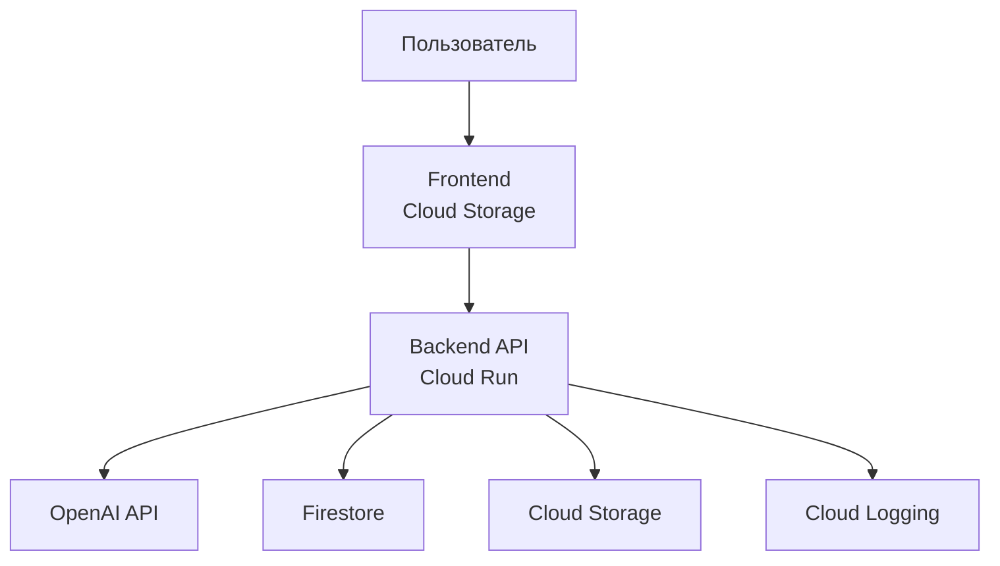
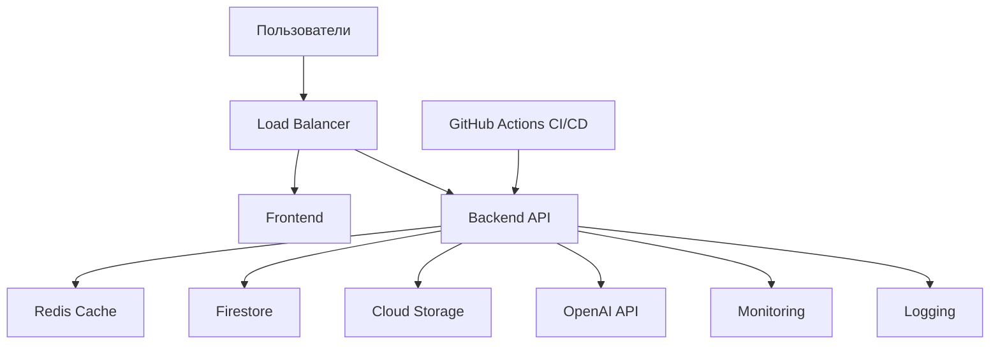
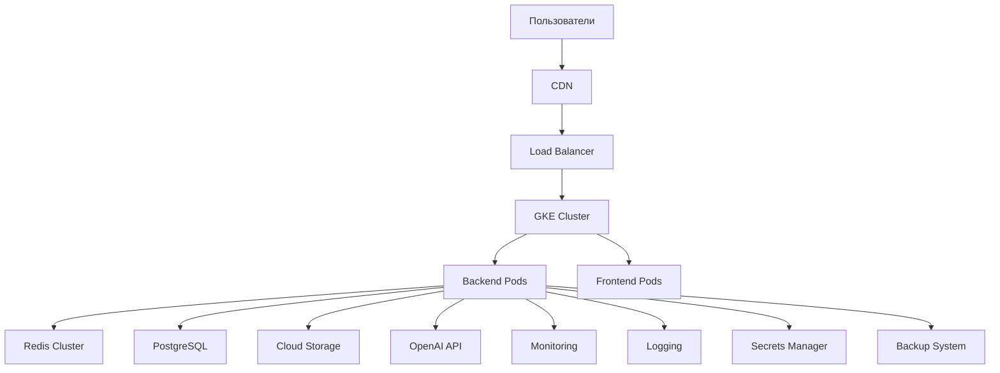

# Лабораторная работа 4. Разработка инфраструктуры MVP AI приложения

**University:** [ITMO University](https://itmo.ru/ru/)  
**Faculty:** [FICT](https://fict.itmo.ru)  
**Course:** [Cloud platforms as the basis of technology entrepreneurship](https://itmo-ict-faculty.github.io/cloud-platforms-as-the-basis-of-technology-entrepreneurship/)  
**Year:** 2025/2026  
**Group:** U4125  
**Author:** Vladimir Novikov  
**Lab:** Lab 4  
**Date of create:** 08.05.2026  
**Date of finished:** 08.05.2026

---

# Цель работы

Разработать инфраструктуру MVP AI-приложения, продумать архитектуру системы на разных этапах развития продукта, оценить стоимость эксплуатации и обосновать выбор облачных ресурсов.

---

# Описание приложения

В качестве MVP рассматривается AI-приложение для генерации и анализа текстового контента.
Пользователь может:

* отправлять текстовый запрос;
* получать AI-ответ;
* хранить историю запросов;
* загружать файлы;
* взаимодействовать через Web-интерфейс.

Приложение развивается в 3 этапа:

1. Начальное MVP
2. Тестирование партнёрами
3. Production-решение

---

# Ход работы

## Этап 1 — Начальное MVP

На первом этапе основная задача — быстро запустить продукт с минимальными затратами.

Используемые сервисы:

* Frontend — Cloud Storage Static Hosting
* Backend API — Cloud Run
* База данных — Firestore
* AI API — OpenAI API
* Хранение файлов — Cloud Storage
* Мониторинг — Cloud Logging

### Архитектура MVP

### Обоснование выбора

* **Cloud Run** позволяет запускать backend без управления серверами.
* **Firestore** подходит для быстрого старта и хранения JSON-структур.
* **Cloud Storage** используется для хранения файлов пользователей.
* Использование внешнего AI API снижает сложность инфраструктуры.
* Минимальные расходы на старте позволяют быстро протестировать гипотезу.

### Предполагаемая нагрузка

* до 100 пользователей;
* до 1000 запросов в день;
* небольшое количество файлов.

### Примерная стоимость

| Ресурс        | Стоимость в месяц |
| ------------- | ----------------- |
| Cloud Run     | ~$5               |
| Firestore     | ~$3               |
| Cloud Storage | ~$2               |
| Logging       | ~$1               |
| OpenAI API    | ~$15              |
| **Итого**     | **~$26/мес**      |

---

# Этап 2 — Тестирование партнёрами

После появления первых пользователей инфраструктура должна стать более стабильной и масштабируемой.

Добавляются:

* Load Balancer
* Redis Cache
* CI/CD pipeline
* Отдельная тестовая среда
* Monitoring & Alerts

### Архитектура этапа тестирования

### Обоснование выбора

* **Load Balancer** распределяет нагрузку между экземплярами backend.
* **Redis Cache** уменьшает количество запросов к AI API и БД.
* **CI/CD** ускоряет обновление приложения.
* Мониторинг позволяет быстро реагировать на ошибки.

### Предполагаемая нагрузка

* до 5000 пользователей;
* до 100000 запросов в день;
* активная работа с файлами.

### Примерная стоимость

| Ресурс               | Стоимость в месяц |
| -------------------- | ----------------- |
| Cloud Run            | ~$40              |
| Firestore            | ~$25              |
| Redis                | ~$30              |
| Cloud Storage        | ~$10              |
| Load Balancer        | ~$20              |
| Monitoring & Logging | ~$15              |
| OpenAI API           | ~$250             |
| **Итого**            | **~$390/мес**     |

---

# Этап 3 — Production

На production этапе основной акцент делается на отказоустойчивость, безопасность и масштабируемость.

Добавляются:

* Kubernetes (GKE)
* Managed PostgreSQL
* CDN
* Multi-zone deployment
* Secrets Manager
* Backup system

### Архитектура Production

### Обоснование выбора

* **GKE** обеспечивает гибкое масштабирование контейнеров.
* **PostgreSQL** лучше подходит для сложных связей и аналитики.
* **CDN** ускоряет доставку контента пользователям.
* **Secrets Manager** безопасно хранит API-ключи.
* Backup system повышает отказоустойчивость.

### Предполагаемая нагрузка

* более 50000 пользователей;
* миллионы запросов;
* высокая доступность 24/7.

### Примерная стоимость

| Ресурс               | Стоимость в месяц |
| -------------------- | ----------------- |
| GKE                  | ~$250             |
| PostgreSQL           | ~$120             |
| Redis Cluster        | ~$80              |
| Load Balancer + CDN  | ~$70              |
| Cloud Storage        | ~$40              |
| Monitoring & Logging | ~$50              |
| Backup System        | ~$30              |
| OpenAI API           | ~$1500            |
| **Итого**            | **~$2140/мес**    |

---

# Сравнение этапов

| Этап         | Основная цель      | Технологии            | Стоимость |
| ------------ | ------------------ | --------------------- | --------- |
| MVP          | Быстрый запуск     | Cloud Run + Firestore | ~$26      |
| Тестирование | Масштабирование    | Load Balancer + Redis | ~$390     |
| Production   | Отказоустойчивость | GKE + PostgreSQL      | ~$2140    |

---

# Выводы

В ходе лабораторной работы была спроектирована инфраструктура AI-приложения для трёх этапов развития продукта.

Основные выводы:

* На раннем этапе важно минимизировать расходы и быстро проверять гипотезы.
* Serverless-решения хорошо подходят для MVP.
* По мере роста нагрузки требуется кеширование, балансировка и CI/CD.
* Production-инфраструктура должна обеспечивать масштабируемость, безопасность и отказоустойчивость.
* Не всегда самое дешёвое решение является оптимальным в долгосрочной перспективе — важно учитывать дальнейший рост продукта.

Разработка инфраструктуры заранее помогает избежать проблем при масштабировании и упрощает переход между этапами развития приложения.
