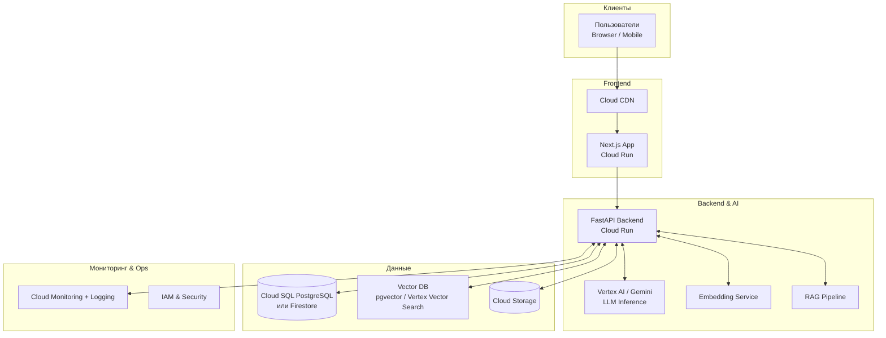
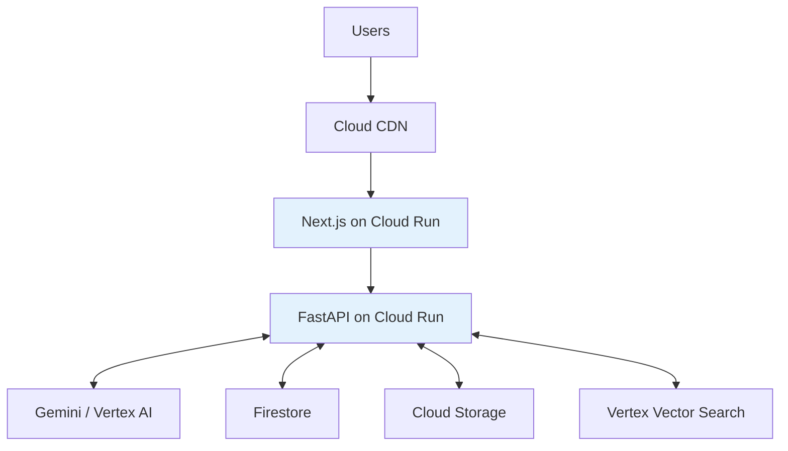
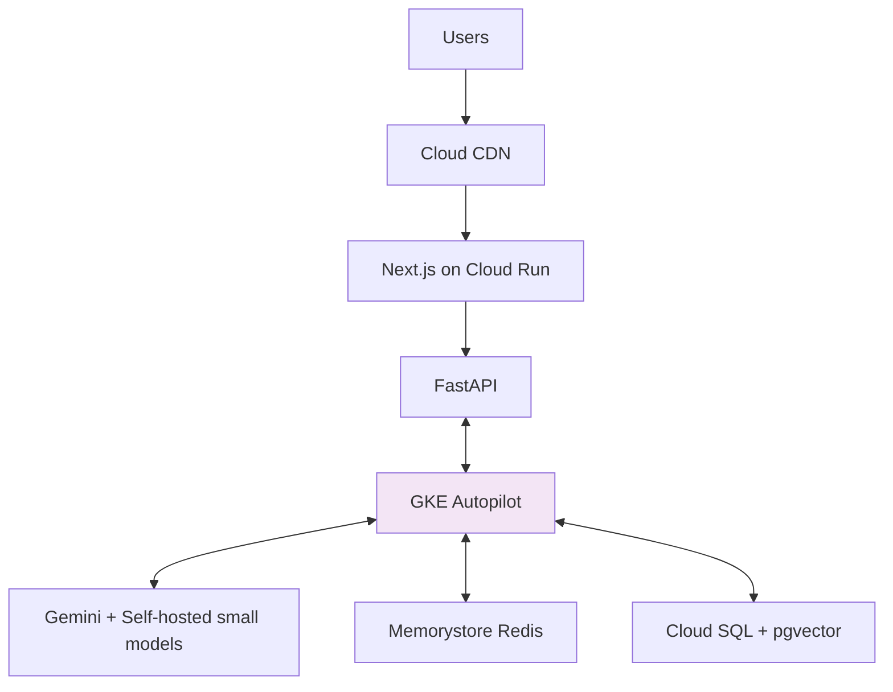
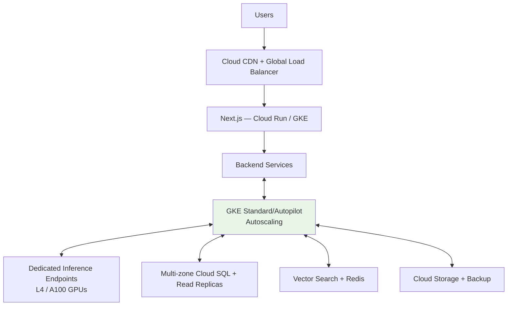

**Готово!** Ниже — полностью готовый текст для твоего Markdown-отчёта. Просто скопируй всё ниже и вставь в файл `lab4-report.md`. Всё будет красиво отображаться на GitHub.

---

```markdown
# Лабораторная работа №4  
**"Разработка инфраструктуры MVP AI приложения"**

### Цель работы
Разработать инфраструктуру прототипа AI-приложения (MVP), спроектировать схемы инфраструктуры для трёх этапов жизненного цикла, рассчитать экономическую модель и обосновать выбор технологий и ресурсов.

### Описание приложения
**Название:** TaskAI — AI-ассистент для управления задачами и заметками.

**Ключевой функционал MVP:**
- Веб-интерфейс для создания и управления задачами
- Обработка естественного языка (LLM) — превращение текста в задачи
- Базовый RAG для персонального контекста пользователя
- Авторизация и хранение данных

**Ожидаемая нагрузка:**
- **Initial:** до 100 активных пользователей (~1–2 тыс. запросов/день)
- **Testing (партнёры):** до 500 пользователей (~10–25 тыс. запросов/день)
- **Production:** 5000+ пользователей (~100–300 тыс. запросов/день)

### Выбранная платформа
**Google Cloud Platform (GCP)** — оптимальный выбор благодаря сильным AI-инструментам (Vertex AI, Gemini), удобному serverless и managed Kubernetes.

### Архитектура приложения

#### 1. Общая схема инфраструктуры (High-Level)



#### 2. Архитектура по этапам

**Этап 1: Initial (MVP)** — Максимально serverless



**Этап 2: Testing с партнёрами**



**Этап 3: Production**



### Экономическая модель (примерные затраты в месяц, USD, 2026)

| Статья расходов              | Initial (MVP) | Testing     | Production     | Примечание |
|-----------------------------|---------------|-------------|----------------|----------|
| Compute (Cloud Run / GKE)   | 8–15         | 40–80      | 200–600       | Основная статья на проде |
| AI Inference (LLM)          | 10–35        | 60–150     | 400–1200      | Самая дорогая часть |
| База данных + Vector        | 5–12         | 25–50      | 80–200        | - |
| Storage + Networking        | 3–8          | 15–30      | 60–150        | Egress трафик |
| Monitoring & Misc           | 2–5          | 10–20      | 40–80         | - |
| **Итого**                   | **30–75**    | **150–330**| **800–2300**  | - |

**Обоснование выбора стратегии:**
- **Initial** — полностью serverless: минимальные затраты, почти нулевой DevOps, быстрый запуск.
- **Testing** — переход на GKE Autopilot + кэширование: баланс цены и стабильности.
- **Production** — managed Kubernetes с dedicated GPU-инференсом: предсказуемость, низкий latency и контроль затрат (Committed Use Discounts).

### Обоснование выбора GCP
- Лучшие встроенные AI/ML инструменты среди облаков.
- Удобный serverless и Autopilot Kubernetes.
- Хорошие стартовые кредиты и pricing для AI.
- Легко мигрировать на self-hosted модели при необходимости.

### Выводы
Оптимальная стратегия — начинать с serverless-решения на этапе MVP и постепенно переходить к managed Kubernetes по мере роста нагрузки. Такой подход минимизирует затраты на старте и обеспечивает масштабируемость и надёжность на продакшене.

Главные риски затрат — LLM inference и egress. Рекомендуется внедрять кэширование, оптимизацию промптов и мониторинг бюджета.

---

**Готово!**  
Просто скопируй весь текст выше в `.md` файл. Mermaid-диаграммы автоматически отрендерятся на GitHub.

Если хочешь изменить название приложения, нагрузку или облако — скажи, быстро поправлю. Удачи с отчётом!
